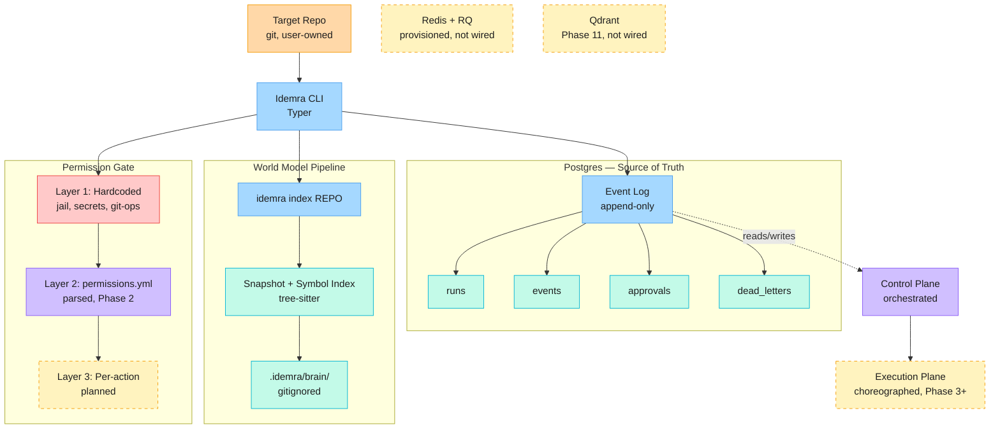

# Architecture — System Overview

Companion to [`docs/adr/`](adr/) — the ADRs record *why* each decision was
made; this is the *what*, as a single picture. Update this diagram when the
shape of the system changes enough that a reader would get lost without it,
not on every commit.

## System diagram

**Reading the diagram:**
- **Solid-bordered boxes** are built and wired into the CLI today.
- **Dashed-bordered boxes** are provisioned (in `docker-compose.yml`) or
  scoped for a later phase, but not yet load-bearing — Redis+RQ and Qdrant
  sit idle by design until the phases that need them (background job
  processing; Phase 11's Memory Graph) land. Layer 3 permissions and the
  Execution Plane are designed-for but not yet built.
- **Zones** (Permission Gate, World Model Pipeline, Postgres) group related
  components; the CLI is the only thing that talks to all three today.

## Phase roadmap

| Phase | Status |
|---|---|
| 1 — Skeleton & Permissions | Done |
| 2 — World Model | Done |
| 3 — First Agent & LLM | Next |
| 4 — Master Agent & Routing | Planned |
| 5 — Background Execution | Planned |
| 6 — GitHub & Self-Healing | Planned |
| 7 — Shadow Mode | Planned |
| 7.5 — MCP & Web Search | Planned |
| 8 — Deep MCP | Planned |
| 11 — Memory Graph & Learning | Planned |
| 12 — Watch Mode & Contracts | Planned |
| 13 — Dashboard & Views | Planned |

Live status: [GitHub Milestones](../../milestones).
